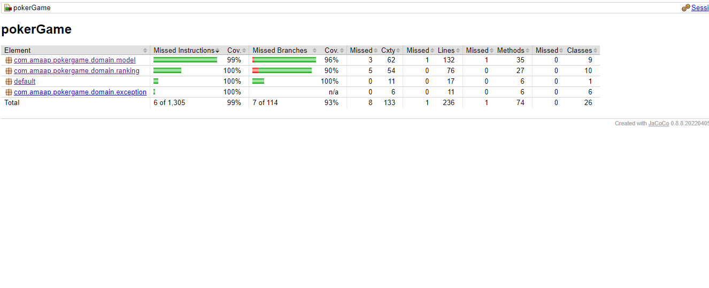

# PokerGame Extension

## Problem Statement

Modify the poker program to include the following new hand rankings:

- **Straight Flush:** All cards are in the same suit and in sequence.
- **Two Pair:** Two pairs of cards have the same rank.

The new hand rankings are:

- **Straight Flush:** All cards are in the same suit and in sequence.
- **Four of a Kind:** Four of the cards have the same rank.
- **Full House:** Three cards of one rank, the other two of another rank.
- **Flush:** All cards are in the same suit.
- **Straight:** All cards are in sequence (aces can be high or low, but not both at once).
- **Three of a Kind:** Three of the cards have the same rank.
- **Two Pair:** Two pairs of cards have the same rank.
- **Pair:** Two cards have the same rank.
- **High Card:** None of the above conditions are met.

### Modification:

The high card rule should return the highest card as well. For example, the hand ["S2" "D5" "C7" "ST" "HA"] should return "high-card-ace".

# Solution:

## Packages:
-    Domain
-    Enum
-    Exception
-    Ranking

## Classes
-   Domain
-     Card
-     DeckOfCard
-     Player
-     PlayGame
-     Hand
-     RankCount
-   Enum
-     Rank
-     Suit
-   Ranking
-     Flush
-     RoyalFlush
-     StraightFlush
-     FourOfKind
-     FullHouse
-     Straight
-     ThreeOfKind
-     TowPair
-     Pair
-     HighCard

     

